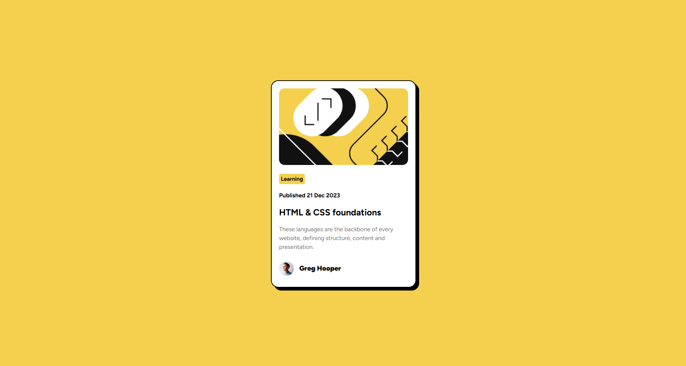

# Frontend Mentor - Blog preview card solution

This is a solution to the [Blog preview card challenge on Frontend Mentor](https://www.frontendmentor.io/challenges/blog-preview-card-ckPaj01IcS). Frontend Mentor challenges help you improve your coding skills by building realistic projects. 

### Screenshot




### Links

- Solution URL: [Solution on frontend mentor](https://www.frontendmentor.io/solutions/blog-review-page-using-flexbox-CsMUvMTuLQ)
- Live Site URL: [Live site](https://navanshu-qwerty.github.io/blog-preview-card/)

## My process

My first intuitions were to divide the web page into different segments such as: <br>
```
body
└── container
    └── card
        ├── image
        ├── tag
        ├── date
        ├── title
        ├── description
        └── author
            ├── avatar
            └── name
```
        
<1> I built a container class that would treat the main body as a flexbox and store the information cards.
<2> I defined a reusable card class that would be able to store the information required. Also in future if the page ever needs to hold several cards, it is possible because of the class declaration.
<3> To ensure that the images imported inside the card fits the description, i created separate classes that pre-define their size.


### Built with

- Semantic HTML5 markup
- CSS custom properties
- Flexbox

### What I learned

This project improved my understanding of spacing and layout in CSS. I became much more comfortable using margins, padding, Flexbox alignment, reusable classes, and structuring a webpage before writing code. Rather than styling elements as I went, I learned to think in terms of reusable components.

### Continued development

I plan to continue improving my CSS skills by learning responsive layouts, hover and focus states, transitions, and more advanced positioning techniques. My goal is to become comfortable building responsive interfaces without relying on trial and error.

## AI Collaboration

I used ChatGPT primarily as a learning assistant rather than a code generator.

During this project it helped me:

- review my HTML and CSS structure
- understand Flexbox alignment and spacing
- explain concepts such as `inline-block`, selectors, and reusable classes
- debug layout issues while encouraging me to reason about the solution myself instead of simply copying code

The biggest benefit was learning a structured approach to building webpages by first breaking designs into reusable components before writing CSS.

## Author

- Frontend Mentor - [@navanshu-qwerty](https://www.frontendmentor.io/profile/navanshu-qwerty)


